Absolutely. Below is a complete, polished, recruiter-friendly and research-focused `README.md` for IntelliSec. You can replace your current README entirely with this.

````markdown
# 🛡️ IntelliSec

### Intelligent Web Security Posture Management Through Cryptographic Risk Analysis, Attack-Path Correlation, Compliance Mapping, and Post-Quantum Readiness Assessment

<p align="center">
  <strong>A Research-Driven Web Security Posture Intelligence Platform</strong>
</p>

<p align="center">
  Transforming deterministic security observations into attack-path intelligence, contextual risk scores, compliance mappings, post-quantum readiness assessments, and controlled AI-assisted security reports.
</p>

<p align="center">
  <a href="https://intellisec-xi.vercel.app/">
    
  </a>
  
  
  
</p>

---

## 🌐 Live Application

Experience the deployed IntelliSec platform:

### 🚀 [Launch IntelliSec](https://intellisec-xi.vercel.app/)

> **Ethical Use Notice:** IntelliSec is designed exclusively for websites and systems owned by the user or for which the user has explicit authorization to perform security assessments.

---

## 📸 Platform Preview

<p align="center">
  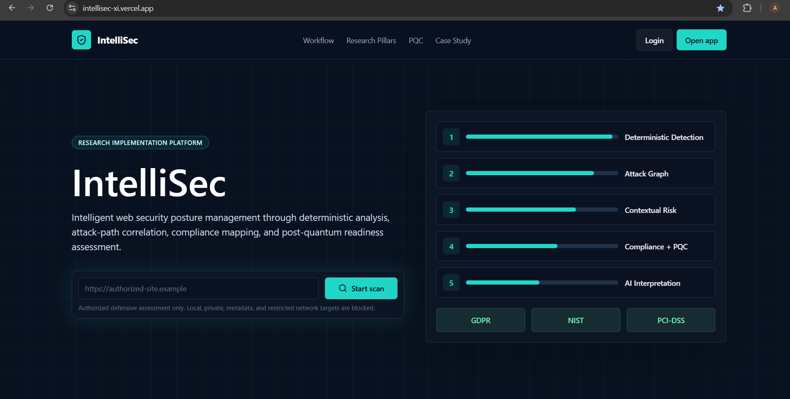
</p>

---

# 📖 Project Overview

**IntelliSec** is a production-style, research-driven web security posture management platform designed to move beyond traditional vulnerability detection.

Most web security scanners identify isolated vulnerabilities or configuration issues. However, real-world cybersecurity risk cannot always be understood by examining findings individually.

IntelliSec introduces an intelligence layer that transforms deterministic web security observations into:

- Structured security findings
- Cryptographic risk intelligence
- Directed attack-path correlations
- Five-factor contextual risk scores
- Technical compliance mappings
- Post-Quantum Cryptography (PQC) readiness assessments
- Controlled AI-assisted security interpretation
- Developer, compliance, and executive-level reports
- Historical security posture tracking

The platform accepts an authorized web target and performs deterministic analysis of its TLS configuration, digital certificates, HTTP security headers, and cookies.

The resulting structured observations are processed by multiple research engines to provide a more comprehensive understanding of the target's overall security posture.

---

# 🎯 Problem Statement

Traditional web vulnerability scanners are highly effective at detecting individual security weaknesses. However, several important challenges remain.

Security findings are often presented independently, without identifying whether multiple weaknesses can interact to create a larger attack path.

Severity-based scoring systems may also fail to consider important contextual factors such as:

- Data sensitivity
- Business criticality
- Authentication exposure
- Internet accessibility
- Cryptographic weaknesses
- Multi-stage attack possibilities

Additionally, traditional security scanners rarely provide integrated support for:

- Compliance mapping
- Post-quantum migration planning
- Context-aware security prioritization
- Controlled AI interpretation

This creates a gap between **vulnerability detection** and **actionable security intelligence**.

IntelliSec addresses this problem by transforming deterministic security observations into contextual and research-driven security posture intelligence.

---

# 🔬 Research Gap

Existing free and commercial web security scanners primarily focus on identifying isolated vulnerabilities and configuration weaknesses.

However, they rarely combine all of the following capabilities within a single security analysis pipeline:

1. Deterministic security detection
2. Attack-path correlation
3. Contextual risk scoring
4. Compliance control mapping
5. Post-Quantum Cryptography readiness assessment
6. Controlled AI-assisted interpretation

IntelliSec implements this missing intelligence layer.

A key design principle of the platform is that **Large Language Models never determine whether a vulnerability exists**.

All security findings are generated using deterministic security checks.

AI operates only after the security analysis pipeline has generated structured JSON findings.

---

# 💡 Proposed Solution

IntelliSec introduces a multi-stage security intelligence architecture.

```text
                    ┌──────────────────────────┐
                    │    Authorized Web URL    │
                    └─────────────┬────────────┘
                                  │
                                  ▼
                    ┌──────────────────────────┐
                    │   SSRF-Safe Validation   │
                    └─────────────┬────────────┘
                                  │
                                  ▼
               ┌──────────────────────────────────┐
               │   Deterministic Security Engine  │
               │                                  │
               │  • TLS Analysis                  │
               │  • Certificate Inspection        │
               │  • HTTP Security Headers         │
               │  • Cookie Security               │
               └─────────────────┬────────────────┘
                                 │
                                 ▼
                    ┌────────────────────────┐
                    │  Structured Findings   │
                    └────────────┬───────────┘
                                 │
             ┌───────────────────┼────────────────────┐
             │                   │                    │
             ▼                   ▼                    ▼
    ┌────────────────┐  ┌────────────────┐  ┌────────────────┐
    │  Attack-Path   │  │ Contextual Risk│  │   Compliance   │
    │  Correlation   │  │    Scoring     │  │    Mapping     │
    └────────┬───────┘  └────────┬───────┘  └────────┬───────┘
             │                   │                    │
             └───────────────────┼────────────────────┘
                                 │
                                 ▼
                      ┌────────────────────┐
                      │   PQC Readiness    │
                      │     Assessment     │
                      └─────────┬──────────┘
                                │
                                ▼
                      ┌────────────────────┐
                      │   Controlled AI    │
                      │   Interpretation   │
                      └─────────┬──────────┘
                                │
                                ▼
               ┌────────────────────────────────┐
               │ Security Intelligence Reports  │
               │                                │
               │ • Developer                    │
               │ • Compliance                   │
               │ • Executive                    │
               └────────────────────────────────┘
```

---

# ✨ Key Features

| Feature | Description |
|---|---|
| 🔍 Deterministic Security Detection | Identifies security observations using deterministic checks |
| 🔐 TLS Analysis | Evaluates supported TLS versions and negotiated cryptographic configurations |
| 📜 Certificate Intelligence | Analyzes certificate issuer, subject, expiry, signature, and public-key information |
| 🛡️ HTTP Security Headers | Evaluates critical web security headers |
| 🍪 Cookie Security | Inspects relevant cookie security configurations |
| 🔗 Attack-Path Correlation | Connects related findings using directed graph analysis |
| 📊 Contextual Risk Scoring | Calculates risk using five contextual dimensions |
| 📋 Compliance Mapping | Maps technical findings to GDPR, NIST, and PCI-DSS indicators |
| ⚛️ PQC Readiness | Evaluates post-quantum migration preparedness |
| 🤖 Controlled AI | Generates interpretation only from structured security findings |
| 📈 Historical Tracking | Stores previous scans for security posture monitoring |
| 📄 JSON Reports | Allows structured security intelligence export |
| 🖨️ Printable Reports | Supports browser-based printable security reports |
| 🔒 SSRF Protection | Blocks dangerous and restricted scan targets |
| 👤 Authentication | Provides user registration and login functionality |

---

# 🖥️ Application Dashboard

The IntelliSec dashboard provides a centralized interface for launching authorized security assessments and accessing findings, attack paths, compliance mappings, PQC assessments, and research capabilities.

<p align="center">
  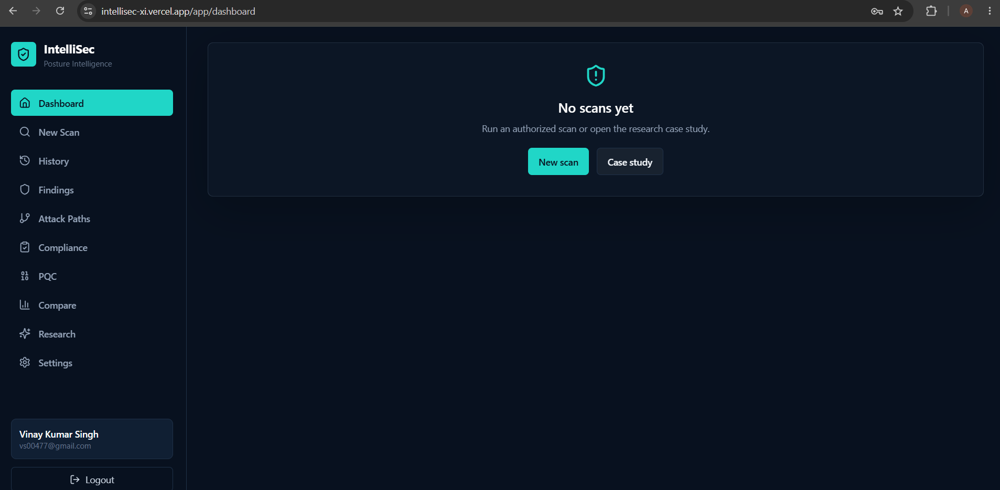
</p>

---

# ⚙️ How IntelliSec Works

The user begins by providing an authorized website URL.

Before executing the analysis, the user must confirm ownership or explicit authorization.

The user can also provide contextual information about the target, including:

- Website category
- Data sensitivity
- Exposure type
- Authentication status
- Business criticality

<p align="center">
  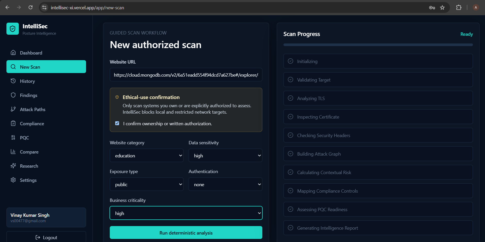
</p>

The security analysis pipeline then executes multiple stages.

<p align="center">
  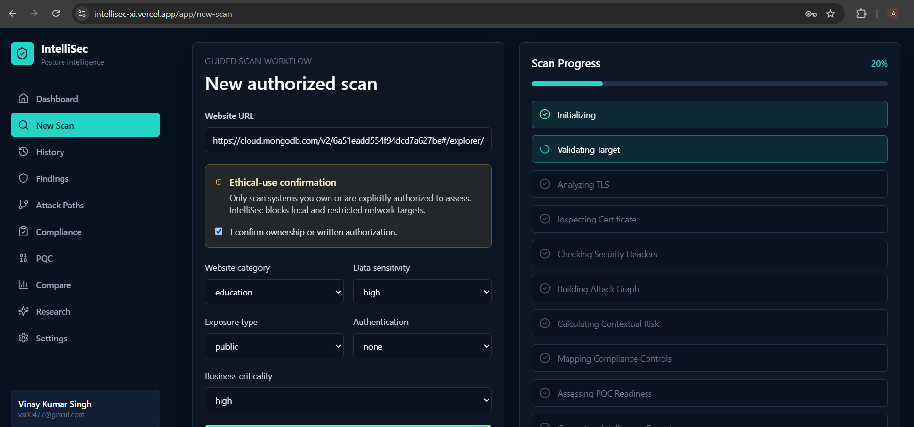
</p>

The workflow includes:

```text
Initializing
     ↓
Validating Target
     ↓
Analyzing TLS
     ↓
Inspecting Certificate
     ↓
Checking Security Headers
     ↓
Building Attack Graph
     ↓
Calculating Contextual Risk
     ↓
Mapping Compliance Controls
     ↓
Assessing PQC Readiness
     ↓
Generating Intelligence Report
```

---

# 📊 Security Intelligence Overview

After completing the security analysis, IntelliSec generates an integrated security posture dashboard.

<p align="center">
  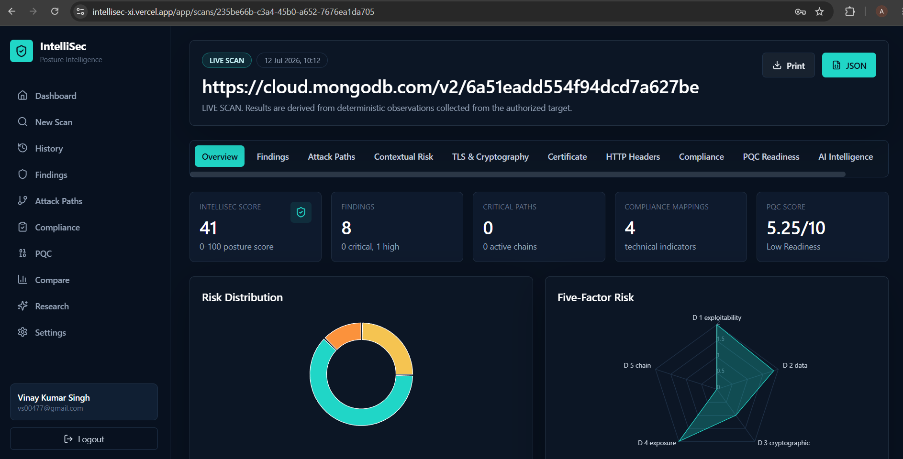
</p>

The overview presents:

- IntelliSec posture score
- Total findings
- Critical attack paths
- Compliance mappings
- PQC readiness score
- Risk distribution
- Five-factor risk visualization

---

# 🔎 Deterministic Security Findings

IntelliSec separates security detection from AI interpretation.

Security observations are generated using deterministic checks and stored as structured findings.

<p align="center">
  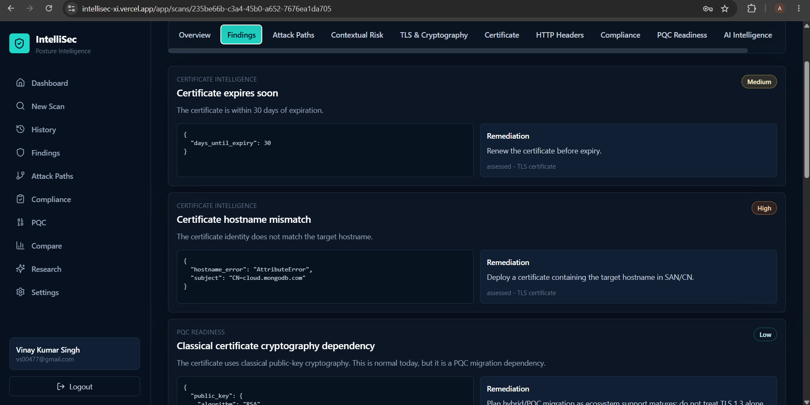
</p>

Each finding may contain:

```text
Finding Name
     ↓
Security Category
     ↓
Severity
     ↓
Structured Evidence
     ↓
Recommended Remediation
     ↓
Assessment Source
```

This architecture reduces the possibility of AI-generated security hallucinations influencing the vulnerability detection process.

---

# 🔗 Attack-Path Correlation

One of the core research components of IntelliSec is its attack-path correlation engine.

Traditional scanners often analyze findings independently.

IntelliSec uses directed graph rules to identify relationships between security findings.

<p align="center">
  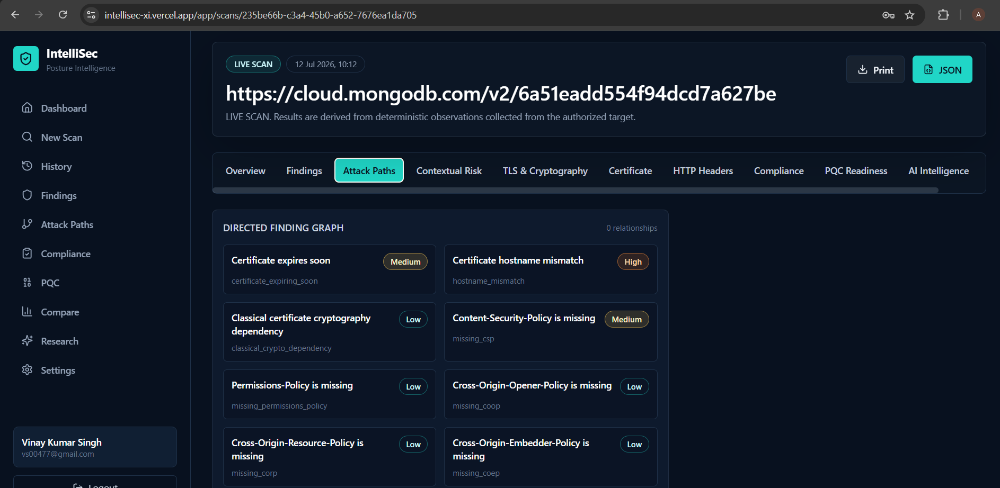
</p>

The attack graph is implemented using **NetworkX**.

```text
Finding A
    │
    ▼
Finding B
    │
    ▼
Finding C
    │
    ▼
Potential Attack Chain
```

When multiple security weaknesses create a meaningful chain, IntelliSec applies a chain amplification factor.

---

# 🧮 Attack-Path Risk Formula

The backend implements the research equation:

```text
α(k) = 1 + 0.35 × ln(k),  k ≥ 2
```

Where:

```text
k = Number of findings participating in an attack chain
```

The composite score is calculated as:

```text
Scomposite = Mean Base Score × α(k)
```

The research paper's printed example reports:

```text
Mean Score = 3.83

α(3) = 1.38

Reported Composite Score = 9.1/10
```

However:

```text
3.83 × 1.38 ≈ 5.3
```

IntelliSec preserves the published research methodology by implementing the equation exactly and transparently documenting this discrepancy in the source code and tests.

---

# 📈 Five-Factor Contextual Risk Scoring

Traditional severity scoring alone may not fully represent real-world security risk.

IntelliSec introduces a Five-Factor Contextual Risk Model.

<p align="center">
  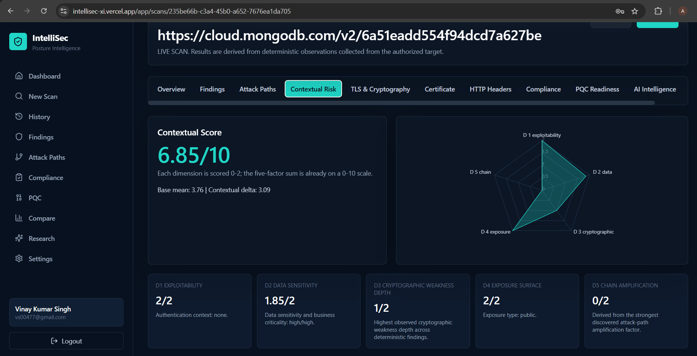
</p>

The model evaluates five dimensions.

| Dimension | Description |
|---|---|
| D1 | Exploitability |
| D2 | Data Sensitivity |
| D3 | Cryptographic Weakness Depth |
| D4 | Exposure Surface |
| D5 | Chain Amplification |

Each dimension receives a score between:

```text
0 → Minimum Risk Contribution

2 → Maximum Risk Contribution
```

The final contextual risk score is normalized to:

```text
0 – 10
```

This allows IntelliSec to prioritize findings based on technical severity and operational context.

---

# 🔐 TLS & Cryptographic Analysis

IntelliSec analyzes the cryptographic posture of the authorized target.

<p align="center">
  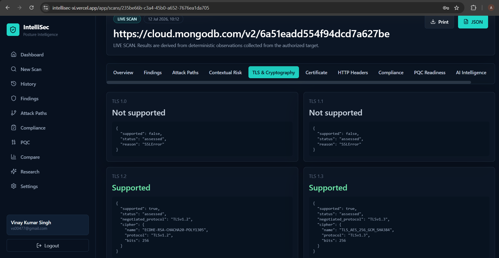
</p>

The analysis evaluates:

- TLS 1.0
- TLS 1.1
- TLS 1.2
- TLS 1.3
- Negotiated protocols
- Cipher information
- Cryptographic key dependencies

The system distinguishes between modern transport security and actual post-quantum cryptographic adoption.

---

# 📜 Certificate Intelligence

IntelliSec extracts and analyzes certificate metadata.

<p align="center">
  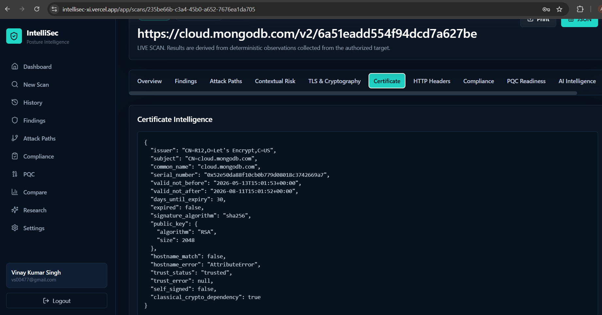
</p>

Certificate analysis includes:

- Certificate issuer
- Certificate subject
- Common name
- Serial number
- Validity period
- Expiration status
- Signature algorithm
- Public-key algorithm
- Public-key size
- Hostname validation
- Trust information
- Self-signed status
- Classical cryptographic dependency

---

# 🛡️ HTTP Security Header Analysis

The platform evaluates critical HTTP security headers.

<p align="center">
  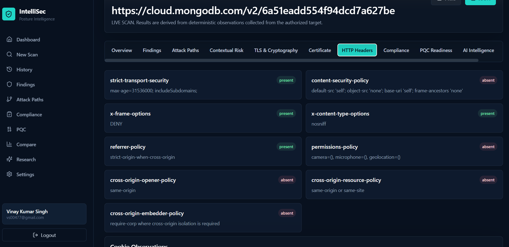
</p>

Analyzed headers include:

```text
Strict-Transport-Security

Content-Security-Policy

X-Frame-Options

X-Content-Type-Options

Referrer-Policy

Permissions-Policy

Cross-Origin-Opener-Policy

Cross-Origin-Resource-Policy

Cross-Origin-Embedder-Policy
```

Missing security controls are transformed into structured findings for further risk analysis.

---

# 📋 Compliance Mapping

IntelliSec maps technical findings to relevant compliance and security framework indicators.

<p align="center">
  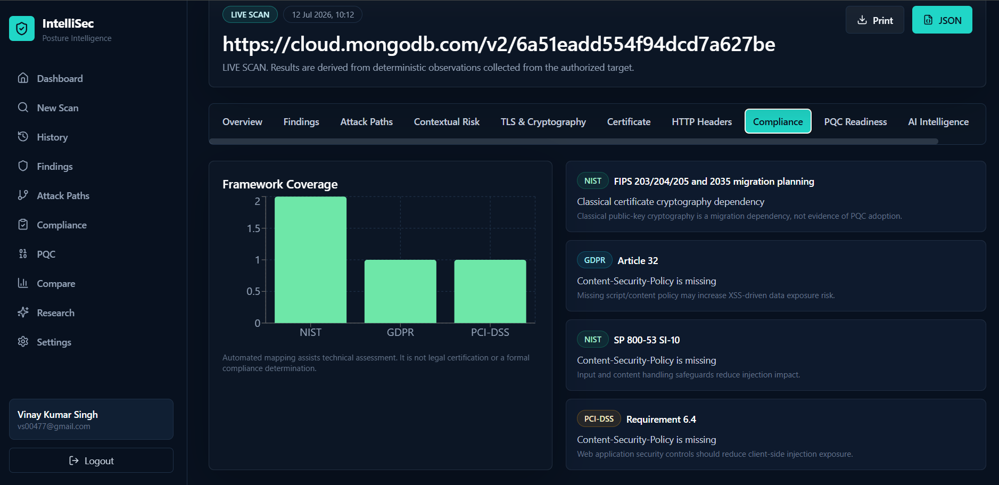
</p>

Currently supported mappings include:

### NIST

Security findings may be mapped to relevant NIST technical security controls.

### GDPR

Technical findings may be mapped to applicable GDPR security requirements.

### PCI-DSS

Web application security observations may be mapped to relevant PCI-DSS requirements.

> **Important:** IntelliSec compliance mappings are technical indicators only. They do not constitute legal certification, regulatory approval, or a formal compliance determination.

---

# ⚛️ Post-Quantum Cryptography Readiness

One of the major research contributions of IntelliSec is its Post-Quantum Cryptography readiness engine.

<p align="center">
  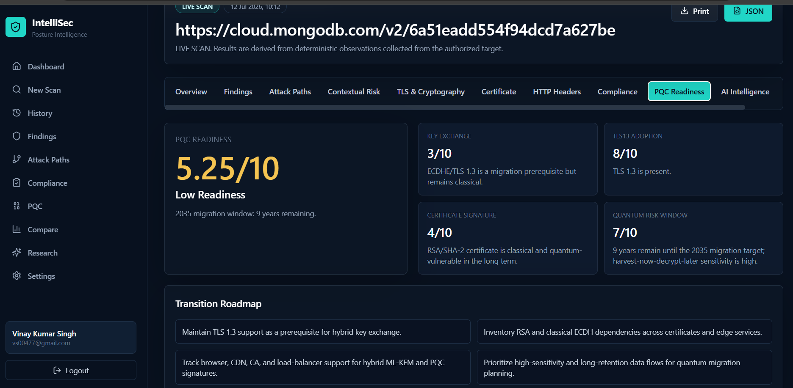
</p>

The PQC engine evaluates four major dimensions:

| Dimension | Purpose |
|---|---|
| Key Exchange | Evaluates classical cryptographic dependencies |
| TLS 1.3 Adoption | Measures modern TLS adoption |
| Certificate Signature | Evaluates certificate signature algorithms |
| Quantum Risk Window | Estimates migration urgency |

The final PQC readiness score is presented on a:

```text
0 – 10 Scale
```

The platform also generates a transition roadmap.

Example recommendations may include:

```text
Maintain TLS 1.3 support.

Inventory RSA and classical ECDH dependencies.

Track hybrid ML-KEM ecosystem support.

Monitor PQC certificate signature adoption.

Prioritize high-sensitivity and long-retention data.

Prepare cryptographic migration strategies.
```

> IntelliSec treats TLS 1.3 as a migration prerequisite and **not as evidence of Post-Quantum Cryptography adoption**.

---

# 🤖 Controlled AI Intelligence

IntelliSec follows a controlled AI architecture.

AI does not perform vulnerability detection.

<p align="center">
  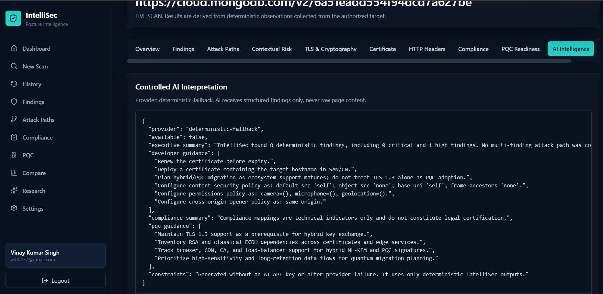
</p>

The architecture follows:

```text
Target Website
      ↓
Deterministic Security Analysis
      ↓
Structured Findings
      ↓
Risk + Compliance + PQC Engines
      ↓
Structured JSON
      ↓
Controlled AI Interpretation
      ↓
Security Intelligence Report
```

AI receives only structured security information.

It does not receive raw page content for vulnerability determination.

This approach helps separate:

```text
Security Detection
```

from:

```text
Security Interpretation
```

---

# 🧠 AI Model Used

IntelliSec supports AI-assisted security interpretation through a configurable provider architecture.

Current environment configuration:

```env
AI_PROVIDER=gemini
AI_MODEL=gemini-1.5-flash
AI_API_KEY=
```

The AI layer can generate:

- Executive summaries
- Developer guidance
- Compliance summaries
- PQC migration guidance

If an AI API key is unavailable or the AI provider fails, IntelliSec automatically uses deterministic fallback summaries.

```text
AI Available
      ↓
Structured Findings
      ↓
Controlled AI Interpretation
```

or:

```text
AI Unavailable
      ↓
Structured Findings
      ↓
Deterministic Fallback Reports
```

Therefore, the core IntelliSec security analysis pipeline does not depend on an external AI service.

---

# 🔬 Six Research Pillars

<p align="center">
  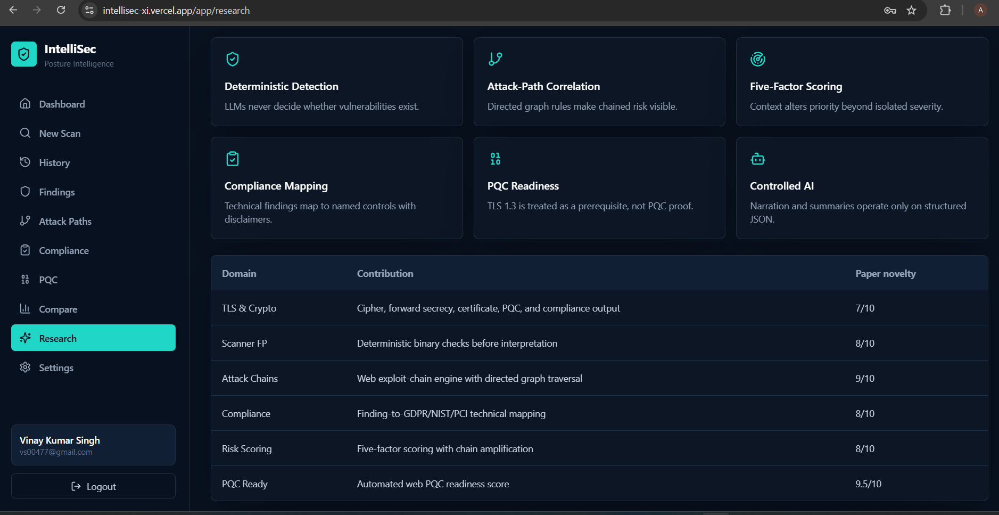
</p>

The IntelliSec research implementation is based on six major pillars.

### 1. Deterministic Detection

LLMs never determine whether vulnerabilities exist.

### 2. Attack-Path Correlation

Directed graph rules identify relationships between security findings.

### 3. Five-Factor Risk Scoring

Context modifies security priorities beyond isolated severity.

### 4. Compliance Mapping

Technical findings are mapped to named security controls with appropriate disclaimers.

### 5. PQC Readiness

TLS 1.3 is treated as a migration prerequisite rather than proof of quantum-safe cryptography.

### 6. Controlled AI

AI-generated narratives operate only on structured security data.

---

# 🛡️ Cybersecurity Concepts Implemented

IntelliSec demonstrates the practical implementation of multiple cybersecurity concepts.

### Web Application Security

- HTTP security headers
- Cookie security
- Secure transport configurations
- Web exposure analysis

### Network Security

- Target validation
- Restricted network protection
- Private IP blocking
- Redirect validation
- SSRF mitigation

### Cryptography

- TLS protocol analysis
- Cipher inspection
- Certificate analysis
- Public-key cryptography
- RSA dependency analysis
- ECDH dependency analysis
- Certificate signatures

### Security Risk Management

- Risk scoring
- Contextual risk analysis
- Attack-chain amplification
- Security posture assessment

### Graph-Based Cybersecurity Analysis

- Directed graphs
- Finding relationships
- Attack-path correlation
- Chain amplification

### Governance, Risk, and Compliance

- GDPR mapping
- NIST mapping
- PCI-DSS mapping

### Post-Quantum Security

- Classical cryptography dependency analysis
- PQC migration readiness
- Quantum risk windows
- Hybrid cryptography migration planning

### AI in Cybersecurity

- Controlled AI interpretation
- Structured security data processing
- AI fallback architecture
- Separation of detection and interpretation

---

# 🏢 Business Capacity & Real-World Applications

IntelliSec is designed as more than an academic demonstration.

The architecture can serve as the foundation for multiple cybersecurity products and services.

### SaaS Security Posture Management

Organizations could continuously monitor their internet-facing web applications.

### Cybersecurity Consulting

Security consultants could use the platform to generate structured security posture reports.

### Compliance Preparation

Organizations could identify technical security observations relevant to compliance frameworks.

### PQC Migration Planning

Enterprises could use cryptographic dependency information to prepare long-term quantum-safe migration strategies.

### DevSecOps Integration

The deterministic security analysis engine could be integrated into CI/CD pipelines.

### Security Monitoring

Scheduled assessments could identify security posture changes over time.

### Executive Cyber Risk Reporting

Technical findings could be transformed into executive-level risk summaries.

### Educational & Research Applications

The platform can demonstrate practical implementations of:

- Cybersecurity analysis
- Graph algorithms
- Risk scoring
- Compliance engineering
- Cryptography
- Post-quantum migration
- Controlled AI

---

# 📜 Historical Security Posture Tracking

IntelliSec stores previous security assessments, allowing users to monitor security posture over time.

<p align="center">
  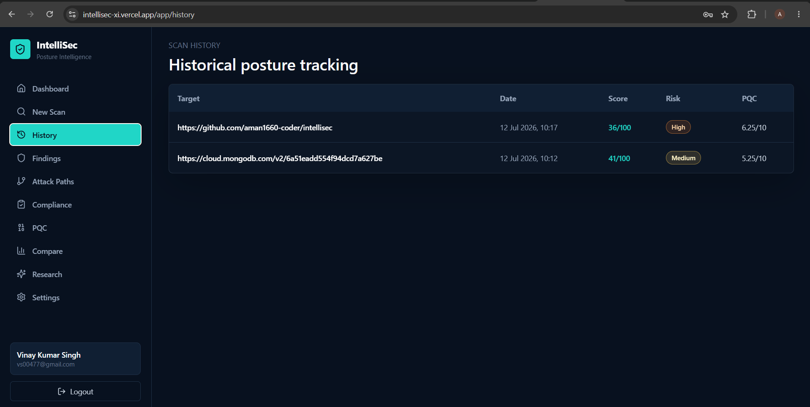
</p>

Historical tracking includes:

- Target URL
- Scan date
- IntelliSec score
- Risk level
- PQC readiness score

---

# 🏗️ Technology Stack

## Frontend

| Technology | Purpose |
|---|---|
| React | Component-based frontend development |
| Vite | Frontend build system |
| Tailwind CSS | User interface styling |
| Recharts | Security data visualization |
| JavaScript | Frontend application logic |

## Backend

| Technology | Purpose |
|---|---|
| FastAPI | REST API development |
| Python | Security analysis and research engines |
| NetworkX | Attack-path graph analysis |
| Pytest | Backend testing |

## Database

| Technology | Purpose |
|---|---|
| MongoDB | Application and scan data storage |
| MongoDB Atlas | Cloud database deployment |

## Artificial Intelligence

| Technology | Purpose |
|---|---|
| Gemini | Controlled security interpretation |
| Deterministic Fallback | AI-independent report generation |

## Deployment

| Technology | Purpose |
|---|---|
| Vercel | Frontend deployment |
| Render | Backend deployment |
| MongoDB Atlas | Cloud database infrastructure |
| Docker | Backend containerization |

---

# 📁 Project Architecture

```text
IntelliSec/
│
├── backend/
│   │
│   ├── deterministic scanners
│   ├── authentication
│   ├── API routes
│   ├── attack-path engine
│   ├── contextual risk engine
│   ├── compliance mapping engine
│   ├── PQC readiness engine
│   ├── AI interpretation layer
│   └── tests
│
├── frontend/
│   │
│   ├── authentication pages
│   ├── dashboard
│   ├── scan workflow
│   ├── findings
│   ├── attack paths
│   ├── contextual risk
│   ├── TLS analysis
│   ├── certificate intelligence
│   ├── HTTP header analysis
│   ├── compliance
│   ├── PQC readiness
│   ├── AI intelligence
│   └── research interface
│
├── docs/
│   └── deployment documentation
│
├── sample-data/
│   └── labeled research case-study metadata
│
├── screenshots/
│   ├── 01-landing-page.png
│   ├── 02-user-registration.png
│   ├── 03-dashboard.png
│   ├── 04-new-scan-configuration.png
│   ├── 05-scan-progress.png
│   ├── 06-security-overview.png
│   ├── 07-security-findings.png
│   ├── 08-attack-path-analysis.png
│   ├── 09-contextual-risk-analysis.png
│   ├── 10-tls-cryptography-analysis.png
│   ├── 11-certificate-intelligence.png
│   ├── 12-http-security-headers.png
│   ├── 13-compliance-mapping.png
│   ├── 14-pqc-readiness.png
│   ├── 15-ai-intelligence.png
│   ├── 16-research-methodology.png
│   └── 17-scan-history.png
│
├── README.md
└── LICENSE
```

---

# 🔄 Processing Workflow

```text
Authorized URL
      ↓
SSRF-Safe Validation
      ↓
Deterministic TLS Analysis
      ↓
Certificate Inspection
      ↓
HTTP Security Header Analysis
      ↓
Cookie Security Analysis
      ↓
Structured Security Findings
      ↓
NetworkX Attack-Path Correlation
      ↓
Five-Factor Contextual Risk Scoring
      ↓
Compliance Mapping
      ↓
PQC Readiness Assessment
      ↓
Controlled AI Interpretation
          OR
Deterministic Fallback
      ↓
Developer Report
Compliance Report
Executive Report
```

---

# 🔌 API Overview

## Authentication

```http
POST /api/auth/register
POST /api/auth/login
GET  /api/auth/me
```

## Target Validation

```http
POST /api/targets/validate
```

## Security Scanning

```http
POST /api/scans
GET  /api/scans
GET  /api/scans/{scan_id}
```

## Security Findings

```http
GET /api/scans/{scan_id}/findings
```

## Attack Paths

```http
GET /api/scans/{scan_id}/attack-paths
```

## Compliance

```http
GET /api/scans/{scan_id}/compliance
```

## PQC Readiness

```http
GET /api/scans/{scan_id}/pqc
```

## Reports

```http
GET /api/scans/{scan_id}/reports
```

## Research Case Study

```http
GET /api/case-study
```

## System Health

```http
GET /api/health
```

---

# 🚀 Installation Guide

## Prerequisites

Ensure the following technologies are installed:

```text
Python

Node.js

npm

Git

MongoDB
```

---

## 1️⃣ Clone the Repository

```bash
git clone YOUR_GITHUB_REPOSITORY_URL
```

Navigate to the project:

```bash
cd IntelliSec
```

---

# ⚙️ Backend Installation

Navigate to the backend:

```bash
cd backend
```

Create a Python virtual environment:

```bash
python -m venv .venv
```

Activate the virtual environment on Windows:

```bash
.venv\Scripts\activate
```

For Linux/macOS:

```bash
source .venv/bin/activate
```

Install dependencies:

```bash
pip install -r requirements.txt
```

Create the environment configuration:

### Windows

```bash
copy .env.example .env
```

### Linux/macOS

```bash
cp .env.example .env
```

Start the backend:

```bash
uvicorn main:app --reload --port 8000
```

The backend should now be available at:

```text
http://localhost:8000
```

Health check:

```bash
curl http://localhost:8000/api/health
```

---

# 🎨 Frontend Installation

Navigate to the frontend:

```bash
cd frontend
```

Install dependencies:

```bash
npm install
```

Create the environment configuration:

### Windows

```bash
copy .env.example .env
```

### Linux/macOS

```bash
cp .env.example .env
```

Start the development server:

```bash
npm run dev
```

Open the application at:

```text
http://localhost:5173
```

---

# 🔑 Environment Variables

Example backend environment configuration:

```env
MONGODB_URI=

MONGODB_DB=intellisec

JWT_SECRET=

AI_PROVIDER=gemini

AI_API_KEY=

AI_MODEL=gemini-1.5-flash

FRONTEND_URL=http://localhost:5173

CORS_ORIGINS=http://localhost:5173

SCAN_TIMEOUT=6

MAX_REDIRECTS=3

MAX_RESPONSE_BYTES=262144

RATE_LIMIT=20
```

Frontend environment configuration:

```env
VITE_API_URL=http://localhost:8000/api
```

> IntelliSec works without an `AI_API_KEY`. When the AI service is unavailable, the platform automatically uses deterministic fallback summaries.

---

# 🧪 Testing

Navigate to the backend:

```bash
cd backend
```

Run the test suite:

```bash
pytest
```

The test suite covers:

- SSRF protection
- Target validation
- Deterministic header findings
- Cookie security findings
- Graph construction
- Attack-path correlation
- Chain amplification
- Contextual risk scoring
- Compliance mapping
- PQC scoring
- Research case-study completeness

---

# 🏗️ Frontend Production Build

Navigate to the frontend:

```bash
cd frontend
```

Generate the production build:

```bash
npm run build
```

---

# ☁️ Deployment Architecture

```text
                         Internet
                            │
                            ▼
                  ┌───────────────────┐
                  │      Vercel       │
                  │                   │
                  │  React Frontend   │
                  └─────────┬─────────┘
                            │
                            │ REST API
                            ▼
                  ┌───────────────────┐
                  │      Render       │
                  │                   │
                  │ FastAPI Backend   │
                  └─────────┬─────────┘
                            │
                            ▼
                  ┌───────────────────┐
                  │   MongoDB Atlas   │
                  │                   │
                  │ Cloud Database    │
                  └───────────────────┘
```

### Frontend

Deployed using Vercel.

```text
Root Directory: frontend
```

The frontend environment variable must point to the deployed backend:

```env
VITE_API_URL=YOUR_RENDER_BACKEND_URL/api
```

### Backend

The backend can be deployed as a Render Docker service using:

```text
backend/Dockerfile
```

or:

```text
render.yaml
```

### Database

Production data is stored using MongoDB Atlas through:

```env
MONGODB_URI=
```

Local JSON storage should only be used as a demonstration fallback.

---

# 🧪 Research Case Study Mode

IntelliSec includes a dedicated research case-study mode.

The endpoint:

```http
GET /api/case-study
```

and the corresponding frontend interface generate a labeled:

```text
Research Paper Case Study Dataset
```

This is not presented as a live security scan.

The case study demonstrates:

- Eight deterministic findings
- Two paper-aligned attack chains
- Contextual risk scoring
- Compliance mapping
- PQC readiness
- AI fallback
- Developer reporting
- Compliance reporting
- Executive reporting

---

# 🔒 Ethical Use & Security Controls

IntelliSec is designed exclusively for authorized defensive security assessment.

Users should only scan systems that they:

```text
Own
```

or:

```text
Have Explicit Written Authorization to Assess
```

IntelliSec does not perform:

- Vulnerability exploitation
- Credential brute forcing
- Data exfiltration
- Persistence
- Security evasion
- Denial-of-service attacks

The backend implements protection against unsafe targets, including:

- Localhost
- Loopback addresses
- Private IP addresses
- Link-local addresses
- Metadata endpoints
- Unsupported protocols
- Embedded credentials
- Unsafe redirects

---

# ⚠️ Current Limitations

The current implementation has several research and engineering limitations.

- Attack-path correlation rules are hand-crafted from documented attack patterns.
- PQC scoring uses a configurable but static migration timeline.
- Role-stratified LLM output evaluation remains future work.
- Automated compliance mappings represent technical indicators rather than legal certification.
- Live TLS probing may be affected by CDN configurations, runtime OpenSSL versions, host configurations, and network policies.
- Unavailable security checks are reported transparently rather than represented as successful assessments.

---

# 🔮 Future Scope

Future IntelliSec development may include:

- Machine learning-based attack-path discovery
- Correlation edge learning from incident datasets
- Scheduled security posture monitoring
- Email and notification integrations
- Security posture change detection
- Advanced certificate-chain analysis
- Improved cryptographic inventory
- ML-KEM migration analysis
- Expanded PQC algorithm support
- Formally evaluated role-specific AI reporting
- CI/CD security integrations
- Organization-level multi-target dashboards
- Team collaboration
- PDF security report generation
- Security trend analytics
- Advanced executive risk dashboards

---

# 🎓 Research Contribution

The core contribution of IntelliSec is not simply vulnerability detection.

The platform demonstrates how multiple security engineering concepts can be combined into a unified research architecture:

```text
Deterministic Detection
          +
Attack-Path Correlation
          +
Contextual Risk Scoring
          +
Compliance Mapping
          +
Post-Quantum Readiness
          +
Controlled AI Interpretation
          =
Intelligent Web Security Posture Management
```

IntelliSec demonstrates a shift from:

```text
"What vulnerabilities exist?"
```

towards:

```text
"How are the findings connected,
how does context affect their risk,
which security controls are relevant,
how prepared is the system for future cryptographic migration,
and how can structured results be communicated effectively?"
```

---

# 👨‍💻 Research Authors

**Aman Kumar Singh**

**Rohith Krishna S**

**Harrshan S**

**Neraniki Dinesh Kumar**

**Ms. Inchara K P**

**Dr. Madhumala R B**

---

# 📄 License

A license appropriate for the intended academic, research, or portfolio distribution model should be added before public redistribution of the project.

---

# ⭐ Support the Project

If you find IntelliSec interesting or useful for cybersecurity research, web security analysis, cryptographic risk assessment, or post-quantum migration studies, consider giving the repository a ⭐.

---

<p align="center">
  <strong>IntelliSec</strong>
</p>

<p align="center">
  From Isolated Security Findings to Intelligent Security Posture Management
</p>

<p align="center">
  🛡️ Deterministic Security &nbsp;•&nbsp;
  🔗 Attack Paths &nbsp;•&nbsp;
  📊 Contextual Risk &nbsp;•&nbsp;
  📋 Compliance &nbsp;•&nbsp;
  ⚛️ PQC Readiness &nbsp;•&nbsp;
  🤖 Controlled AI
</p>
````

One change you should make before uploading: replace `YOUR_GITHUB_REPOSITORY_URL` with your actual repository URL. Also, because the README uses external badge websites, GitHub will fetch those badge images from the web; the project screenshots themselves are correctly referenced from your `screenshots/` folder.
## 📸 IntelliSec Platform Screenshots

### 🏠 Landing Page

The IntelliSec landing page introduces the research implementation platform and its five-stage security posture analysis workflow.


---

### 🔐 User Registration

Secure user registration enables users to create their IntelliSec workspace and manage authorized security assessments.


---

### 📊 Security Dashboard

The dashboard provides centralized access to security scans, findings, attack paths, compliance analysis, PQC readiness, research components, and historical results.


---

### 🔍 New Authorized Security Scan

Users can configure an authorized target and provide contextual information including website category, data sensitivity, exposure type, authentication mechanism, and business criticality.


---

### ⚙️ Real-Time Scan Progress

IntelliSec displays the deterministic security analysis pipeline, including target validation, TLS analysis, certificate inspection, HTTP security header checks, attack graph generation, contextual risk calculation, compliance mapping, PQC assessment, and intelligence report generation.


---

### 📈 Security Posture Overview

The scan overview presents the IntelliSec posture score, detected findings, critical attack paths, compliance mappings, PQC readiness score, risk distribution, and five-factor contextual risk visualization.


---

### 🛡️ Security Findings

IntelliSec converts deterministic observations into structured security findings containing severity classifications, technical evidence, and remediation recommendations.


---

### 🔗 Attack-Path Correlation

The directed finding graph correlates individual vulnerabilities and security weaknesses to identify potential multi-stage attack chains.


---

### 🎯 Five-Factor Contextual Risk Analysis

IntelliSec evaluates security posture using five contextual dimensions: exploitability, data sensitivity, cryptographic weakness depth, exposure surface, and chain amplification.


---

### 🔒 TLS & Cryptographic Analysis

The cryptographic analysis engine evaluates supported TLS versions, negotiated protocols, cipher suites, and cryptographic configurations.


---

### 📜 Certificate Intelligence

IntelliSec performs certificate intelligence analysis including issuer information, validity period, signature algorithms, public-key configuration, hostname verification, and classical cryptographic dependencies.


---

### 🌐 HTTP Security Headers

The platform evaluates important HTTP security controls including Content Security Policy, HSTS, X-Frame-Options, Permissions Policy, Referrer Policy, and Cross-Origin policies.


---

### 📋 Compliance Mapping

Technical security findings are mapped to relevant controls from NIST, GDPR, and PCI-DSS frameworks.


---

### ⚛️ Post-Quantum Cryptography Readiness

The PQC readiness engine evaluates key exchange mechanisms, TLS 1.3 adoption, certificate signature algorithms, and quantum migration risk.


---

### 🤖 Controlled AI Intelligence

The AI intelligence layer receives structured deterministic findings rather than raw website content and generates executive summaries, developer guidance, compliance interpretations, and PQC migration recommendations.


---

### 🔬 Research Implementation

The research dashboard explains IntelliSec's core research contributions, including deterministic detection, attack-path correlation, five-factor contextual risk scoring, compliance mapping, PQC readiness assessment, and controlled AI interpretation.


---

### 🕒 Historical Security Posture Tracking

IntelliSec stores previous scan results to support historical posture tracking and comparison of security scores, risk levels, and PQC readiness.

