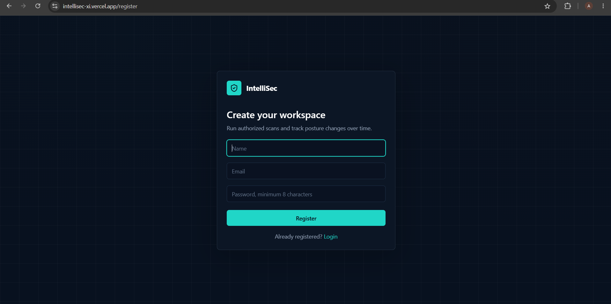

<div align="center">

# 🛡️ IntelliSec

### Intelligent Web Security Posture Management Platform

**Transforming isolated security findings into contextual risk intelligence, attack paths, compliance insights, cryptographic analysis, and AI-powered security recommendations through one unified platform.**

<br>

[](https://intellisec-xi.vercel.app/)

<br>


<br>

### 🌐 [View Live Application](https://intellisec-xi.vercel.app/)

</div>

---

# 📌 About IntelliSec

**IntelliSec** is an intelligent web security posture management platform designed to provide comprehensive security assessment, contextual risk analysis, attack path identification, cryptographic intelligence, compliance mapping, Post-Quantum Cryptography readiness assessment, and AI-powered security recommendations.

Traditional web security tools often generate isolated vulnerability findings without providing sufficient information about how vulnerabilities interact, which risks should be prioritized, how findings affect regulatory compliance, or what remediation actions should be performed first.

IntelliSec addresses this problem by combining multiple security analysis capabilities into one unified platform.

The platform enables users to:

- 🔍 Configure and perform web security assessments
- 📊 Monitor security posture through an interactive dashboard
- 🚨 Identify and analyze security findings
- 🛤️ Discover potential attack paths
- 🧠 Perform contextual risk analysis
- 🔐 Analyze TLS and cryptographic configurations
- 📜 Inspect digital certificates
- 🌐 Evaluate HTTP security headers
- 📋 Map findings to security compliance frameworks
- ⚛️ Assess Post-Quantum Cryptography readiness
- 🤖 Generate AI-powered security intelligence
- 📚 Explore the research methodology behind the platform
- 🕒 Maintain and review security scan history

IntelliSec transforms traditional vulnerability scanning into a more comprehensive **security intelligence and posture management system**.

---

# 🚀 Live Application

<div align="center">

## [🌐 Launch IntelliSec](https://intellisec-xi.vercel.app/)

**Frontend:** Deployed on Vercel  
**Backend:** API-Based Security Analysis Architecture  
**Database:** MongoDB  
**Security Engine:** Python-Based Analysis Modules

</div>

---

# 📸 Application Preview

## 🏠 Modern Security Platform Landing Page

IntelliSec provides a modern and responsive landing page that introduces users to the platform's intelligent web security capabilities.

The landing page highlights the primary objective of the system: transforming traditional security scanning into contextual and actionable security intelligence.

Users can quickly understand the platform's core capabilities, explore its security analysis features, and begin assessing web applications.


---

## 🔐 Secure User Registration

IntelliSec provides a dedicated user registration system that allows users to create accounts and securely access the platform.

The authentication system enables personalized access to security scans, dashboards, analysis results, and historical scan information.

### Authentication Features

- User account registration
- Secure authentication workflow
- Personalized platform access
- Protected application functionality
- User-specific security assessments
- Persistent access to scan history



---

## 📊 Intelligent Security Dashboard

After authentication, users gain access to the IntelliSec security dashboard.

The dashboard provides a centralized overview of the user's web security posture and assessment activities.

The dashboard enables users to quickly understand important security information and navigate to different analysis modules.

### Dashboard Capabilities

- Security posture overview
- Scan statistics
- Risk information
- Recent security assessments
- Security findings overview
- Quick scan access
- Historical scan information
- Centralized security intelligence


---

## ⚙️ New Security Scan Configuration

IntelliSec allows users to configure new web security assessments through an intuitive scan configuration interface.

Users can provide the target web application and configure the required assessment before initiating the security analysis process.

### Scan Configuration Capabilities

- Target website configuration
- Security assessment initialization
- Structured scanning workflow
- User-friendly configuration interface
- Automated security analysis initiation
- Centralized scan management


---

## 🔄 Real-Time Scan Progress

After initiating a security assessment, IntelliSec provides users with a dedicated scan progress interface.

The platform displays the progress of the security analysis while different security modules evaluate the target application.

### Scan Progress Features

- Security assessment progress tracking
- Analysis status monitoring
- Structured scanning stages
- User-friendly progress visualization
- Automated security module execution
- Assessment workflow visibility


---

## 🛡️ Comprehensive Security Overview

The Security Overview module provides a centralized summary of the target application's security posture.

Instead of forcing users to analyze isolated findings individually, IntelliSec organizes important security information into a comprehensive overview.

### Security Overview Capabilities

- Overall security posture assessment
- Risk-level visualization
- Security findings summary
- Prioritized security information
- Centralized analysis results
- Actionable security insights


---

## 🚨 Detailed Security Findings

IntelliSec identifies and presents security findings discovered during the assessment process.

Each finding helps users understand potential weaknesses affecting the target application's security posture.

The structured findings interface enables users to analyze detected issues and understand their security implications.

### Security Finding Capabilities

- Identification of security weaknesses
- Structured vulnerability presentation
- Risk classification
- Security impact information
- Actionable remediation guidance
- Prioritized security findings


---

## 🛤️ Attack Path Analysis

One of IntelliSec's major capabilities is its Attack Path Analysis module.

Traditional vulnerability scanners often display vulnerabilities independently. However, real-world attackers frequently combine multiple weaknesses to compromise systems.

IntelliSec analyzes relationships between security findings to identify potential attack paths.

### Attack Path Capabilities

- Identification of interconnected security weaknesses
- Visualization of possible attack sequences
- Contextual vulnerability relationships
- Multi-stage security risk analysis
- Improved remediation prioritization
- Enhanced understanding of attacker behavior


---

## 🧠 Contextual Risk Analysis

The Contextual Risk Analysis module evaluates security findings based on their broader security context.

Instead of relying only on isolated vulnerability severity scores, IntelliSec considers relationships between findings and their potential impact.

### Contextual Analysis Capabilities

- Context-aware security assessment
- Security risk prioritization
- Finding relationship analysis
- Impact-oriented security insights
- Enhanced vulnerability understanding
- Actionable risk intelligence


---

## 🔐 TLS & Cryptography Analysis

IntelliSec includes a dedicated cryptographic security analysis module.

The platform evaluates TLS configurations and cryptographic security information to identify potential weaknesses affecting secure communication.

### Cryptographic Analysis Capabilities

- TLS configuration analysis
- Cryptographic protocol assessment
- Secure communication evaluation
- Encryption-related security insights
- Cryptographic weakness identification
- Security posture improvement recommendations


---

## 📜 Certificate Intelligence

The Certificate Intelligence module provides detailed information about the digital certificates associated with the assessed web application.

Digital certificates play an important role in secure web communication and identity verification.

IntelliSec provides structured certificate information to help users better understand the target application's cryptographic security posture.

### Certificate Intelligence Features

- Digital certificate analysis
- Certificate configuration information
- Security-related certificate insights
- Certificate validity assessment
- Cryptographic identity information
- Structured certificate intelligence


---

## 🌐 HTTP Security Headers Analysis

HTTP security headers provide important browser-level protections against several common web application attacks.

IntelliSec evaluates the security headers implemented by the target application and identifies potential configuration weaknesses.

### Security Header Analysis

- HTTP header inspection
- Security header detection
- Missing security control identification
- Header configuration assessment
- Browser security posture analysis
- Actionable security recommendations


---

## 📋 Compliance Mapping

IntelliSec maps security findings to relevant cybersecurity standards and compliance frameworks.

This capability helps users understand how technical security weaknesses relate to broader security requirements.

### Compliance Capabilities

- Security finding classification
- Compliance framework mapping
- Security control analysis
- Structured compliance insights
- Improved security governance understanding
- Connection between technical risks and security standards


---

## ⚛️ Post-Quantum Cryptography Readiness

IntelliSec includes a dedicated Post-Quantum Cryptography readiness assessment module.

As quantum computing technologies continue to develop, traditional cryptographic systems may face new security challenges.

The PQC Readiness module evaluates cryptographic information from a future-oriented security perspective.

### PQC Readiness Capabilities

- Cryptographic readiness assessment
- Post-Quantum security awareness
- Existing cryptographic posture analysis
- Future-oriented security intelligence
- Identification of potential cryptographic migration concerns
- Improved understanding of quantum-era security challenges


---

## 🤖 AI-Powered Security Intelligence

The AI Intelligence module enhances traditional security analysis by providing intelligent insights into security findings and risks.

The platform uses AI-assisted analysis to help users better understand security issues and potential remediation priorities.

### AI Intelligence Capabilities

- AI-powered security insights
- Intelligent security finding interpretation
- Contextual risk explanation
- Security recommendation generation
- Improved remediation understanding
- Actionable security intelligence


---

## 🔬 Research Methodology

IntelliSec includes a dedicated Research Methodology section that explains the technical and analytical foundation behind the platform.

This section demonstrates that IntelliSec is not limited to being a traditional CRUD-based web application or vulnerability scanner.

The project combines cybersecurity research concepts with practical software implementation.

### Research Focus Areas

- Web security posture management
- Contextual security analysis
- Attack path identification
- Cryptographic security assessment
- Compliance intelligence
- Post-Quantum Cryptography readiness
- AI-assisted security analysis
- Risk prioritization


---

## 🕒 Security Scan History

IntelliSec maintains a structured history of previous security assessments.

Users can access historical scan information to review previous assessments and monitor their security analysis activities.

### Scan History Capabilities

- Previous security assessment records
- Historical scan information
- Scan result accessibility
- Assessment activity tracking
- Centralized scan management
- Improved security monitoring workflow


---

# ✨ Core Features

| Feature | Description |
|---|---|
| 🔐 User Authentication | Secure user registration and platform access |
| 📊 Security Dashboard | Centralized security posture and assessment overview |
| ⚙️ Scan Configuration | Configure and initiate web security assessments |
| 🔄 Scan Progress | Monitor security assessment execution |
| 🛡️ Security Overview | Comprehensive summary of security posture |
| 🚨 Security Findings | Structured presentation of identified weaknesses |
| 🛤️ Attack Path Analysis | Analyze relationships between multiple security findings |
| 🧠 Contextual Risk Analysis | Evaluate vulnerabilities using broader security context |
| 🔐 TLS Analysis | Assess TLS and cryptographic configurations |
| 📜 Certificate Intelligence | Analyze digital certificate information |
| 🌐 Security Headers | Evaluate HTTP security header implementation |
| 📋 Compliance Mapping | Connect findings with cybersecurity frameworks |
| ⚛️ PQC Readiness | Assess Post-Quantum Cryptography preparedness |
| 🤖 AI Intelligence | Generate intelligent security insights |
| 🔬 Research Methodology | Explain the research foundation of the platform |
| 🕒 Scan History | Maintain and review previous security assessments |
| ☁️ Cloud Deployment | Production deployment for online accessibility |

---

# 🏗️ System Architecture

```text
                         ┌─────────────────────────────┐
                         │            USER             │
                         │         Web Browser         │
                         └──────────────┬──────────────┘
                                        │
                                        │ HTTPS
                                        ▼
                         ┌─────────────────────────────┐
                         │       REACT FRONTEND        │
                         │                             │
                         │    Modern Security UI       │
                         │     Hosted on Vercel        │
                         └──────────────┬──────────────┘
                                        │
                                        │ API Requests
                                        │ JSON Responses
                                        ▼
                         ┌─────────────────────────────┐
                         │       FASTAPI BACKEND       │
                         │                             │
                         │      REST API Layer         │
                         │   Application Logic Layer   │
                         └──────────────┬──────────────┘
                                        │
                  ┌─────────────────────┼─────────────────────┐
                  │                     │                     │
                  ▼                     ▼                     ▼
       ┌──────────────────┐  ┌──────────────────┐  ┌──────────────────┐
       │ SECURITY ANALYSIS│  │ INTELLIGENCE &   │  │     DATABASE     │
       │      ENGINE      │  │  RISK ANALYSIS   │  │                  │
       │                  │  │                  │  │     MongoDB      │
       │ Web Assessment   │  │ Attack Paths     │  │  Persistent Data │
       │ TLS Analysis     │  │ Contextual Risk  │  │      Storage     │
       │ HTTP Headers     │  │ AI Intelligence  │  │                  │
       │ Certificates     │  │ Compliance       │  │                  │
       │ PQC Readiness    │  │                  │  │                  │
       └──────────────────┘  └──────────────────┘  └──────────────────┘
```

---

# 🛠️ Technology Stack

## 💻 Frontend

| Technology | Purpose |
|---|---|
| React.js | Component-based user interface |
| JavaScript | Frontend application functionality |
| HTML5 | Application structure |
| CSS3 | Styling and responsive design |
| REST API Integration | Frontend-backend communication |
| Vercel | Frontend cloud deployment |

---

## ⚙️ Backend

| Technology | Purpose |
|---|---|
| Python | Core backend and security analysis programming |
| FastAPI | Backend framework and REST API development |
| REST APIs | Communication between frontend and backend |
| Security Analysis Modules | Web application security assessment |
| AI Integration | Intelligent security analysis and recommendations |

---

## 🗄️ Database

| Technology | Purpose |
|---|---|
| MongoDB | NoSQL application database |
| Database Collections | Structured security assessment data |
| Persistent Storage | User and security scan information |

---

## 🔒 Security Analysis

| Module | Purpose |
|---|---|
| Web Security Assessment | Analyze web application security posture |
| Security Findings | Identify potential security weaknesses |
| Attack Path Analysis | Discover relationships between security risks |
| Contextual Risk Analysis | Improve risk prioritization |
| TLS Analysis | Evaluate cryptographic configurations |
| Certificate Intelligence | Inspect digital certificate information |
| HTTP Header Analysis | Evaluate browser-level security controls |
| Compliance Mapping | Map findings to security frameworks |
| PQC Readiness | Evaluate Post-Quantum security preparedness |
| AI Intelligence | Generate intelligent security insights |

---

## ☁️ Deployment & Development Tools

| Technology | Purpose |
|---|---|
| Vercel | Frontend deployment |
| Git | Version control |
| GitHub | Source code management |
| VS Code | Development environment |
| MongoDB | Application database |
| Python | Security analysis engine |
| FastAPI | Backend API architecture |

---

# 🔄 IntelliSec Security Analysis Workflow

```text
User
  │
  ▼
Create Account / Login
  │
  ▼
Security Dashboard
  │
  ▼
Configure New Scan
  │
  ▼
Start Security Assessment
  │
  ▼
Security Analysis Engine
  │
  ├──────────────► Security Findings
  │
  ├──────────────► Attack Path Analysis
  │
  ├──────────────► Contextual Risk Analysis
  │
  ├──────────────► TLS & Cryptography Analysis
  │
  ├──────────────► Certificate Intelligence
  │
  ├──────────────► HTTP Security Headers
  │
  ├──────────────► Compliance Mapping
  │
  ├──────────────► PQC Readiness
  │
  └──────────────► AI Security Intelligence
                          │
                          ▼
               Comprehensive Security Report
                          │
                          ▼
                     Scan History
```

---

# 📂 Project Structure

```text
IntelliSec/
│
├── screenshots/
│   │
│   ├── 01-landing-page.png
│   ├── 02-user-registration.png
│   ├── 03-dashboard.png
│   ├── 04-new-scan-configuration.png
│   ├── 05-scan-progress.png
│   ├── 06-security-overview.png
│   ├── 07-security-findings.png
│   ├── 08-attack-path-analysis.png
│   ├── 09-contextual-risk-analysis.png
│   ├── 10-tls-cryptography-analysis.png
│   ├── 11-certificate-intelligence.png
│   ├── 12-http-security-headers.png
│   ├── 13-compliance-mapping.png
│   ├── 14-pqc-readiness.png
│   ├── 15-ai-intelligence.png
│   ├── 16-research-methodology.png
│   └── 17-scan-history.png
│
├── frontend/
│   │
│   ├── src/
│   │   ├── components/
│   │   ├── pages/
│   │   ├── services/
│   │   └── ...
│   │
│   ├── public/
│   ├── package.json
│   └── vite.config.js
│
├── backend/
│   │
│   ├── app/
│   ├── routes/
│   ├── models/
│   ├── services/
│   ├── security/
│   ├── analysis/
│   ├── main.py
│   └── requirements.txt
│
├── .gitignore
└── README.md
```

---

# ⚙️ Getting Started

Follow the instructions below to run IntelliSec locally.

## 1️⃣ Clone the Repository

```bash
git clone YOUR_GITHUB_REPOSITORY_URL
```

Navigate to the project directory:

```bash
cd IntelliSec
```

---

## 2️⃣ Install Frontend Dependencies

Navigate to the frontend directory:

```bash
cd frontend
```

Install the required dependencies:

```bash
npm install
```

---

## 3️⃣ Install Backend Dependencies

Navigate to the backend directory:

```bash
cd backend
```

Create a Python virtual environment:

```bash
python -m venv venv
```

Activate the virtual environment on Windows:

```bash
venv\Scripts\activate
```

Install the required Python dependencies:

```bash
pip install -r requirements.txt
```

---

## 4️⃣ Configure Environment Variables

Create the required environment configuration files according to the project architecture.

Example backend configuration:

```env
MONGODB_URI=your_mongodb_connection_string

SECRET_KEY=your_secure_secret_key

AI_API_KEY=your_ai_api_key_if_required
```

> ⚠️ Never commit `.env` files, database credentials, secret keys, API keys, authentication secrets, or other sensitive information to GitHub.

---

## 5️⃣ Start the Backend Server

Navigate to the backend directory:

```bash
cd backend
```

Run the FastAPI application:

```bash
uvicorn main:app --reload
```

The backend development server will typically run on:

```text
http://localhost:8000
```

---

## 6️⃣ Start the Frontend

Open another terminal and navigate to the frontend directory:

```bash
cd frontend
```

Run the development server:

```bash
npm run dev
```

The frontend development server will typically run on:

```text
http://localhost:5173
```

---

# 🔐 Security Analysis Architecture

IntelliSec combines multiple security assessment capabilities to provide comprehensive web security intelligence.

The security architecture includes:

- Web security posture assessment
- Security weakness identification
- Contextual vulnerability analysis
- Attack path discovery
- Risk prioritization
- TLS configuration analysis
- Cryptographic security assessment
- Digital certificate intelligence
- HTTP security header analysis
- Compliance framework mapping
- Post-Quantum Cryptography readiness
- AI-assisted security intelligence
- Historical security assessment management

---

# 🧠 Contextual Risk Intelligence

Traditional vulnerability management systems frequently analyze security findings independently.

However, isolated vulnerability scores may not accurately represent real-world security risk.

IntelliSec improves security analysis by considering the broader context surrounding identified weaknesses.

The platform focuses on:

- Relationships between security findings
- Potential attack sequences
- Security impact
- Risk prioritization
- Cryptographic weaknesses
- Missing security controls
- Compliance implications
- Actionable remediation intelligence

This enables IntelliSec to provide more meaningful security information than isolated vulnerability reporting.

---

# 🛤️ Attack Path Intelligence

Attack Path Analysis is one of the key analytical capabilities of IntelliSec.

Real-world cyberattacks frequently involve multiple security weaknesses rather than a single vulnerability.

For example:

```text
Initial Security Weakness
          │
          ▼
Missing Security Control
          │
          ▼
Exploitable Configuration
          │
          ▼
Increased Attack Surface
          │
          ▼
Potential Security Impact
```

IntelliSec analyzes these relationships to help users understand how multiple security weaknesses may contribute to broader security risks.

---

# ⚛️ Post-Quantum Cryptography Readiness

The development of quantum computing introduces potential future challenges for existing cryptographic systems.

IntelliSec incorporates Post-Quantum Cryptography readiness analysis to provide a future-oriented security perspective.

The PQC module focuses on:

- Existing cryptographic configurations
- Cryptographic security posture
- Potential quantum-era security concerns
- Awareness of cryptographic migration requirements
- Future-oriented security intelligence

This capability expands IntelliSec beyond traditional web security assessment.

---

# 🤖 AI-Powered Security Intelligence

IntelliSec incorporates AI-assisted security intelligence to improve the interpretation of security assessment results.

The AI module can help provide:

- Security finding explanations
- Contextual risk insights
- Security impact interpretation
- Remediation recommendations
- Prioritization guidance
- Actionable security intelligence

The objective is to make complex cybersecurity information easier to understand and more useful for security decision-making.

---

# 📋 Compliance Intelligence

IntelliSec connects technical security findings with broader cybersecurity standards and compliance requirements.

Compliance mapping helps users understand how security weaknesses may relate to established security practices.

The platform focuses on:

- Security control mapping
- Finding classification
- Compliance-related security insights
- Technical risk interpretation
- Security governance awareness

---

# 🔬 Research Contribution

IntelliSec is designed as both a software engineering project and a cybersecurity research-oriented platform.

The project explores the integration of:

- Web security posture management
- Contextual risk intelligence
- Attack path analysis
- Cryptographic security assessment
- HTTP security analysis
- Digital certificate intelligence
- Compliance mapping
- Post-Quantum Cryptography readiness
- Artificial Intelligence
- Security risk prioritization

The primary research-oriented objective is to move beyond isolated vulnerability detection toward a unified and contextual security intelligence platform.

---

# 🎯 Problem Statement

Traditional web security tools often generate large numbers of independent security findings.

This creates several challenges:

- Security teams may struggle to prioritize vulnerabilities
- Relationships between multiple findings may remain unidentified
- Cryptographic weaknesses may require separate analysis tools
- Compliance implications may not be immediately visible
- Future cryptographic risks may not be considered
- Security findings may be difficult for non-experts to interpret
- Multiple disconnected security tools may be required

**IntelliSec addresses these challenges by integrating web security assessment, attack path analysis, contextual risk intelligence, cryptographic analysis, compliance mapping, Post-Quantum Cryptography readiness, and AI-powered security recommendations into one unified platform.**

---

# 💡 What Makes IntelliSec Different?

IntelliSec goes beyond a traditional CRUD-based academic project or basic vulnerability scanner.

The application combines multiple real-world software engineering and cybersecurity concepts, including:

- Full-stack application development
- Web security assessment
- Security posture management
- Attack path analysis
- Contextual risk intelligence
- Cryptographic security analysis
- Digital certificate intelligence
- HTTP security header assessment
- Compliance mapping
- Post-Quantum Cryptography readiness
- Artificial Intelligence
- REST API development
- User authentication
- Security dashboards
- Historical assessment management
- Cloud deployment

The project demonstrates the development of an integrated cybersecurity ecosystem rather than an isolated frontend, backend, or security scanning application.

---

# 🧠 Key Technical Learnings

Developing IntelliSec involved working with:

- Full-stack application architecture
- React component development
- Python backend programming
- FastAPI REST API development
- Frontend-backend integration
- MongoDB database management
- Web security assessment concepts
- Security finding analysis
- Contextual risk evaluation
- Attack path modeling
- TLS and cryptographic security
- Digital certificate analysis
- HTTP security headers
- Cybersecurity compliance concepts
- Post-Quantum Cryptography
- AI-assisted security analysis
- Security data visualization
- Production deployment
- Git and GitHub version control

---

# 🔮 Future Enhancements

Future development plans for IntelliSec include:

- 🔄 Real-time continuous security monitoring
- 📡 Automated security assessment scheduling
- 🔔 Real-time vulnerability notifications
- 📧 Email security reports
- 📄 Automated PDF security report generation
- 📊 Advanced security analytics dashboards
- 🧠 Enhanced AI security recommendations
- 🔗 Expanded attack path visualization
- 📈 Historical security posture comparison
- 🛡️ Advanced vulnerability validation
- ☁️ Cloud infrastructure security analysis
- 📱 Mobile-responsive security monitoring
- 👥 Advanced role-based access control
- 🏢 Enterprise organization management
- 🔌 Integration with additional security tools
- 📋 Expanded compliance framework support
- ⚛️ Advanced Post-Quantum Cryptography analysis
- 🤖 AI-assisted remediation planning
- 🔄 CI/CD security integration
- 🌐 Continuous attack surface monitoring

---

# 👨‍💻 Developer

<div align="center">

## Aman Kumar Singh

### Computer Science Engineering Student

**Specialization in IoT, Cyber Security and Blockchain Technology**

<br>

Interested in building applications using:

`Cyber Security` • `Artificial Intelligence` • `Full-Stack Development` • `Blockchain` • `IoT` • `Cloud Technologies`

<br>

### 🌐 [View Live Project](https://intellisec-xi.vercel.app/)

</div>

---

# 🤝 Contributing

Contributions, suggestions, and feature requests are welcome.

To contribute:

1. Fork the repository.
2. Create a new feature branch.
3. Make your changes.
4. Commit the changes.
5. Push the branch.
6. Open a Pull Request.

---

# ⭐ Support This Project

If you found IntelliSec interesting or useful, consider giving the repository a ⭐.

It helps support the project and its continued development.

---

<div align="center">

# 🛡️ IntelliSec

### Intelligent Security • Contextual Risk • Future-Ready Cyber Defense

<br>

**Built with ❤️ by Aman Kumar Singh**

<br>

[](https://intellisec-xi.vercel.app/)

</div>